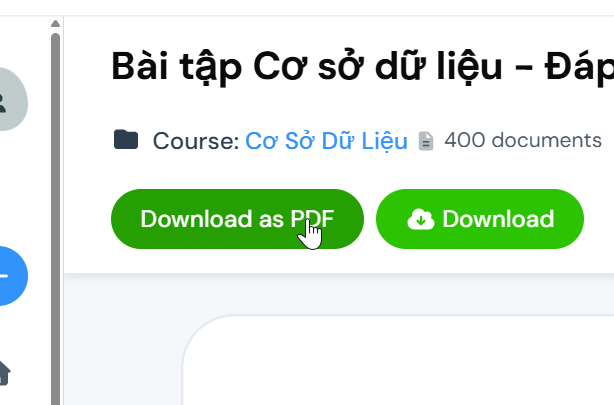

# Studotools

**Userscript giúp tải xuống tài liệu từ Studocu/Scribd dưới dạng PDF**

[Xem bản tiện ích ở đây](https://github.com/nguynkhn/studotools/tree/extension)

## Tính năng

- **Tải xuống PDF**: Chuyển đổi tài liệu Studocu/Scribd thành tệp PDF
- **Mở không giới hạn**: Bỏ qua giới hạn che mờ tài liệu của Studocu bằng cách xóa tự động cookie giám sát

## Cách cài đặt

1. Tải [Tampermonkey](http://tampermonkey.net/) về trình duyệt của bạn (hiện tại chỉ có Tampermonkey là hỗ trợ `GM_cookie`).
2. Lưu tệp [studotools.user.js](https://raw.githubusercontent.com/nguynkhn/studotools/refs/heads/userscript/studotools.user.js) và cài đặt Userscript theo hướng dẫn của từng tiện ích.
3. Hoàn tất!

## Cách sử dụng

1. Truy cập một tài liệu trên Studocu/Scribd
2. Nhấp nút **"Download as PDF"** ở bên cạnh nút **"Download"**
3. Điều chỉnh lựa chọn in trang (nếu cần) rồi lưu file PDF

## Lưu ý

- Userscript này chỉ hoạt động trên các trang tài liệu của Studocu/Scribd
- Nút tải xuống sẽ chỉ xuất hiện khi trang tài liệu đã tải đầy đủ
- Chất lượng PDF phụ thuộc vào tài liệu gốc trên Studocu/Scribd (tức là bạn nhìn thấy gì thì sẽ được tải về cái đó).\
    Nếu tài liệu của bạn bị cắt bớt một đoạn thì có thể điều chỉnh kích cỡ trang (A4 hoặc Letter) và hướng trang (Landscape hoặc Portrait) sao cho phù hợp.

## Đóng góp

Nếu bạn tìm thấy lỗi hoặc có ý tưởng cải thiện, vui lòng tạo issue hoặc pull request <3!
