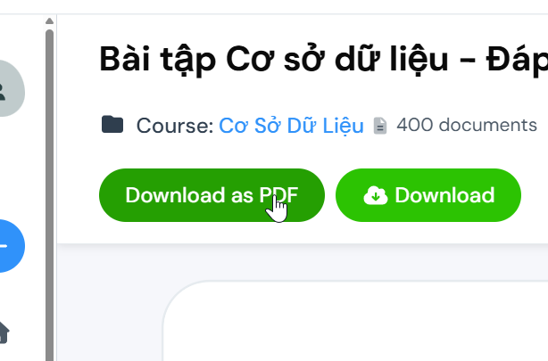

# Studotools

**Tiện ích giúp tải xuống tài liệu từ Studocu/Scribd dưới dạng PDF**

[Xem bản userscript ở đây](https://github.com/nguynkhn/studotools/tree/userscript)

## Tính năng

- **Tải xuống PDF**: Chuyển đổi tài liệu Studocu/Scribd thành tệp PDF
- **Mở không giới hạn**: Bỏ qua giới hạn che mờ tài liệu của Studocu bằng cách xóa tự động cookie giám sát

## Cách cài đặt

1. Tải về [mã nguồn của extension](https://github.com/nguynkhn/studotools/releases/latest) dưới dạng tệp nén và giải nén chúng ra một thư mục riêng
2. (Đối với các trình duyệt như Chrome, Cốc Cốc, Firefox, ...)\
    Mở Settings > Extensions > Manage Extensions (hoặc mở `chrome://extensions/` trong thanh tìm kiếm)
3. Bật **Developer mode** (góc trên bên phải)
4. Chọn **Load unpacked** (góc trên bên trái) > Chọn thư mục dự án
5. Hoàn tất!

## Cách sử dụng

1. Truy cập vào một trang tài liệu trên Studocu/Scribd
2. Nhấp nút **"Download as PDF"** ở bên cạnh nút **"Download"**
3. Chờ trang tải liệu tải xong rồi lưu thành tệp tin PDF

## Lưu ý

- Tiện ích này chỉ hoạt động trên các trang tài liệu của Studocu/Scribd.
- Chất lượng PDF phụ thuộc vào tài liệu gốc trên Studocu/Scribd (tức là bạn nhìn thấy gì thì sẽ nhận cái đó).
- Công cụ được tạo ra với mục đích học tập và nghiên cứu cá nhân. Vui lòng sử dụng có trách nhiệm và tôn trọng bản quyền.

## Đóng góp

Nếu bạn tìm thấy lỗi hoặc có ý tưởng cải thiện, vui lòng tạo issue hoặc pull request <3!
